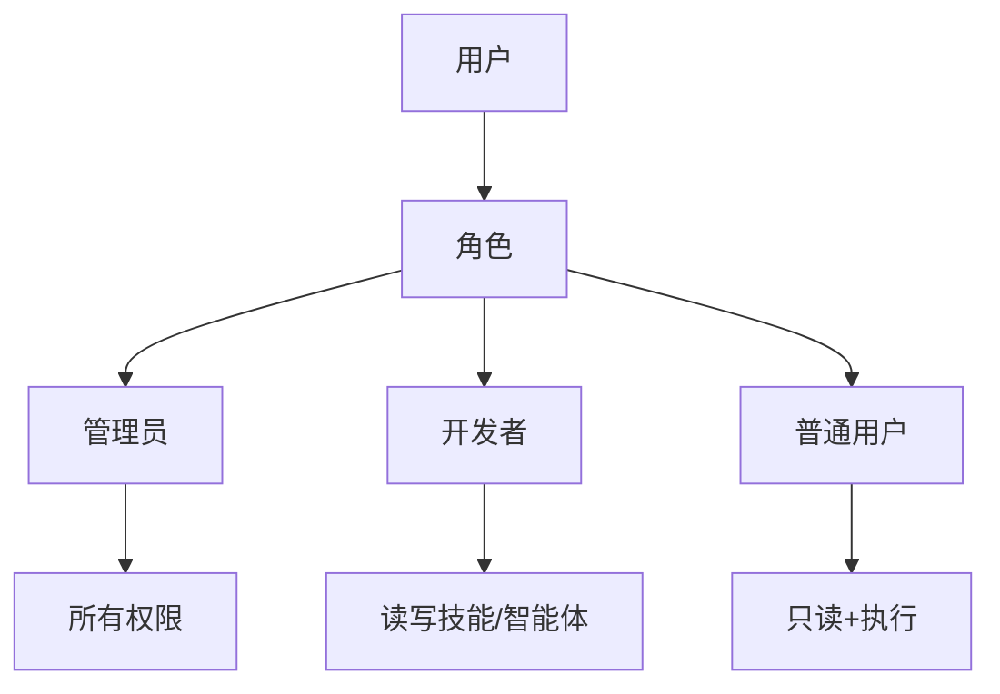
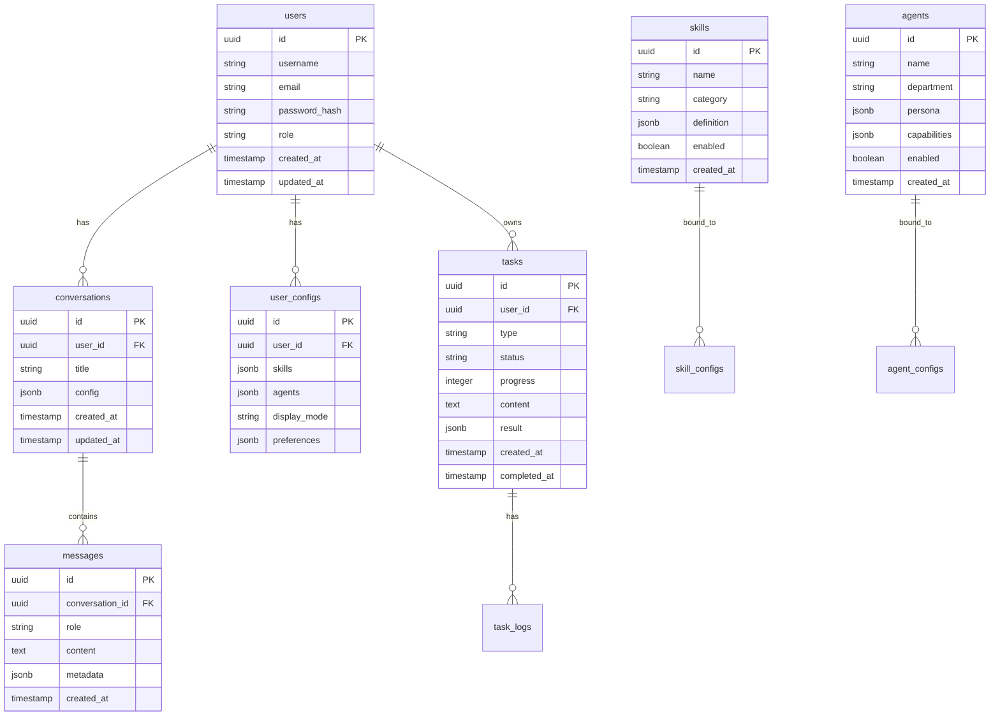
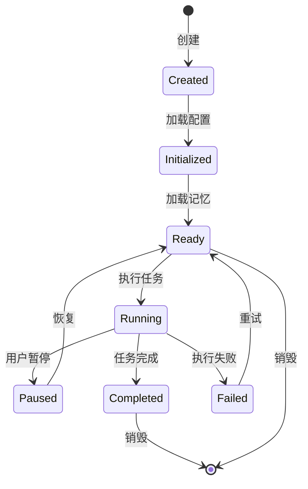
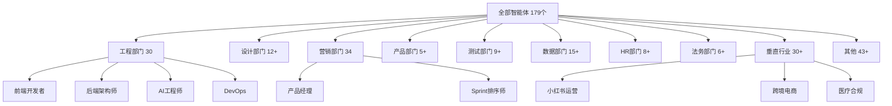

# 灵枢（AIBody）产品需求文档

> 版本：V1.7
> 日期：2026-04-01
> 状态：草稿

---

## 一、产品定位

### 1.0 产品定义

> **灵枢**是一个基于"AI数字身体"理念的私有化AI智能中枢——将**灵枢引擎**、gstack技能库、agency智能体完全融合为一套完整产品，让AI拥有持久记忆、自主规划、跨场景迁移的能力，真正成为人类可信赖、可陪伴、可进化的终身智能伙伴。

### 1.0.1 引擎说明

> **⚠️ 重要声明**：灵枢引擎的底层引擎基于 **openclaw** 构建。
>
> - openclaw 是开源的 AI Gateway 框架，提供 Agent 调度、记忆系统、插件扩展等核心能力
> - 灵枢引擎 在 openclaw 基础上增加了 Go 服务层、任务队列、即时ACK、进度可视化等企业级功能
>
> **简单来说**：灵枢引擎 = openclaw（底层引擎）+ 灵枢增强层

### 1.1 核心原则

| 原则 | 含义 |
|------|------|
| **极简内核** | 聚焦核心服务能力，不做冗余设计，响应更快更稳 |
| **模块可插拔** | 能力完全模块化，按需加载无限扩展 |
| **持久复活** | 全状态持久化，崩溃可恢复，迁移可续跑，AI永生 |

### 1.2 产品愿景

打破当前AI的四大桎梏：

| 桎梏 | 现状 | 灵枢愿景 |
|------|------|----------|
| 孤岛智能 | AI依附单一载体 | 🌍 无界陪伴 |
| 短时智能 | 上下文割裂 | 🧬 长寿懂你 |
| 转瞬智能 | 系统崩溃不可复活 | ⚡ 稳定同行 |
| 有限智能 | 能力碎片化 | 🚀 无限适配 |

### 1.3 目标用户

| 用户类型 | 需求 | 场景 |
|----------|------|------|
| 开发者 | 本地私有化AI开发框架 | 代码编写、调试、发布 |
| 技术团队 | 多Agent协作工作流 | 项目管理、代码评审、自动化 |
| AI研究者 | 可扩展的AI智能体实验 | 技能编排、记忆系统、工具调用 |
| 极客用户 | 私有部署的AI助手 | 日常助手、知识管理、跨设备同步 |

---

## 二、技术架构

### 2.0 整体架构

```
┌─────────────────────────────────────────────────────────┐
│                    灵枢产品                              │
│                  完整的私有化AI中枢                         │
│                                                        │
│  ┌─────────────────────────────────────────────────┐  │
│  │              灵枢App客户端层                      │  │
│  │     Flutter (移动/桌面) │ React (Web)           │  │
│  └─────────────────────────────────────────────────┘  │
│                         ↓ WebSocket/HTTPS               │
│  ┌─────────────────────────────────────────────────┐  │
│  │              灵枢服务层 (Go)                      │  │
│  │   API网关 │ 任务队列 │ 即时ACK │ 进度推送        │  │
│  └─────────────────────────────────────────────────┘  │
│                         ↓ gRPC/HTTP                     │
│  ┌─────────────────────────────────────────────────┐  │
│  │              ★ 灵枢引擎 ★                          │  │
│  │         基于 openclaw 构建                        │  │
│  │   Gateway │ Agent │ Memory │ Skills │ Plugins    │  │
│  └─────────────────────────────────────────────────┘  │
│                         ↓                               │
│  ┌─────────────────────────────────────────────────┐  │
│  │              能力层                              │  │
│  │   gstack技能 (23) │ agency智能体 (179)          │  │
│  └─────────────────────────────────────────────────┘  │
└─────────────────────────────────────────────────────────┘
```

### 2.0.1 命名对照

| 层级 | 名称 | 技术 | 说明 |
|------|------|------|------|
| 客户端层 | 灵枢App | Flutter/Tauri | 自有品牌UI |
| 服务层 | 灵枢服务层 | Go | 高性能API网关 |
| 引擎层 | 灵枢引擎 | Node.js + openclaw | AI执行引擎 |
| 能力层 | gstack/agency | Node.js | 技能和智能体 |

### 2.0.2 openclaw声明

> **本文档中**：
> - "灵枢引擎" = 基于openclaw构建的AI执行引擎
> - "openclaw" = 底层开源框架
> - 两者是产品与底层技术的关系

### 2.1 技术栈

#### 2.1.1 客户端技术栈

| 平台 | 技术方案 |
|------|----------|
| **Android** | Kotlin + Jetpack Compose + MVVM |
| **iOS** | Swift + SwiftUI |
| **macOS / Windows / Linux** | Tauri 2.0 / Flutter Desktop |
| **Web** | React 18 + TypeScript |

#### 2.1.2 服务层技术栈（Go）

| 组件 | 技术 | 说明 |
|------|------|------|
| **API框架** | Go + Gin | 高性能HTTP框架 |
| **WebSocket** | gorilla/websocket | 实时通信 |
| **任务队列** | Redis + 自研 | 任务调度 |
| **ORM** | GORM | 数据库操作 |
| **缓存** | Redis Cluster | 会话缓存 |
| **文件存储** | MinIO | 对象存储 |

#### 2.1.3 执行层技术栈（Node.js + openclaw）

| 组件 | 技术 | 说明 |
|------|------|------|
| **运行时** | Node.js >= 22.12 | JavaScript运行时 |
| **Web框架** | Hono | 轻量高性能 |
| **AI SDK** | OpenAI / Anthropic / Gemini | 模型集成 |
| **Agent框架** | pi-agent-core | 智能体调度 |
| **向量存储** | sqlite-vec | RAG支持 |
| **协议** | MCP SDK | Model Context Protocol |

### 2.2 核心模块定位

| 模块 | 定位 | 技术栈 | 职责 |
|------|------|--------|------|
| **openclaw** | 执行引擎 | Node.js | AI网关+Agent调度+记忆+技能 |
| **gstack技能** | 工程技能库 | Node.js | 23个工程技能 |
| **agency智能体** | 专家智能体库 | Node.js | 179个专家角色 |
| **灵枢网关** | API层 | Go | 路由/队列/ACK/推送 |
| **灵枢大脑** | 增强层 | Go | 任务管理/用户系统 |

### 2.3 灵枢App客户端

> 灵枢App客户端是灵枢的IM客户端，全平台原生开发，直连灵枢Gateway

**使用流程：**
1. 用户安装灵枢App客户端
2. 直连灵枢Gateway（Go服务层）
3. 无需任何外部账号/API
4. 与AI即时对话

**核心优势：**
- 跨平台一致体验（macOS / Windows / Linux / iOS / Android / Web）
- 完全私有化，无需任何外部依赖
- 直连灵枢，数据完全自主
- 深度AI集成，与gstack/agency技能无缝对接

---

## 三、非功能需求【新增】

### 3.1 性能指标

| 指标 | 目标值 | 说明 |
|------|--------|------|
| **API QPS** | 1000+ | 单节点峰值吞吐量 |
| **API延迟P50** | <50ms | 中位数响应时间 |
| **API延迟P99** | <200ms | 99分位响应时间 |
| **WebSocket并发** | 10000+ | 单节点支持连接数 |
| **任务吞吐量** | 100/秒 | 每秒处理任务数 |
| **AI推理延迟** | <3s | 单次AI响应时间（含网络） |
| **冷启动时间** | <5s | Agent首次加载时间 |
| **Memory检索** | <100ms | 向量相似度搜索 |

### 3.2 可用性指标

| 指标 | 目标值 | 说明 |
|------|--------|------|
| **SLA** | 99.9% | 每年停机时间 < 8.7小时 |
| **RTO** | < 1分钟 | 故障恢复时间目标 |
| **RPO** | < 1分钟 | 数据恢复点目标 |
| **服务可用率** | 99.9% | 月度可用率 |
| **自动恢复** | < 30秒 | 容器崩溃自动重启 |

### 3.3 安全要求【新增】

#### 3.3.1 认证机制

| 认证方式 | 说明 | 适用场景 |
|----------|------|----------|
| **JWT** | Access Token (15min) + Refresh Token (7d) | API调用 |
| **OAuth 2.0** | 授权码模式 | 第三方登录 |
| **API Key** | 静态密钥 | 服务间调用 |

#### 3.3.2 加密标准

| 层级 | 加密方式 | 说明 |
|------|----------|------|
| **传输加密** | TLS 1.3 | 全链路HTTPS |
| **Token存储** | 内存 | 不持久化到磁盘 |
| **敏感数据** | AES-256 | 本地加密存储 |
| **数据库** | TDE | 透明数据加密 |
| **WireGuard** | ChaCha20-Poly1305 | 隧道加密 |

#### 3.3.3 权限模型



| 角色 | 权限 |
|------|------|
| **管理员** | 所有权限 |
| **开发者** | 读写技能/智能体配置 |
| **普通用户** | 只读配置、执行任务 |

### 3.4 可扩展性要求

| 指标 | 目标值 |
|------|--------|
| **水平扩展** | 支持10+节点集群 |
| **插件热加载** | 无需重启 |
| **技能动态注册** | 运行时生效 |
| **多租户支持** | 100+租户 |

### 3.5 资源限制

| 资源 | 限制 |
|------|------|
| **单任务超时** | 5分钟（可配置） |
| **并发任务数/用户** | 10个 |
| **历史消息存储** | 90天 |
| **向量记忆条数** | 10000条/用户 |
| **单文件上传** | 100MB |

---

## 四、API接口定义【新增】

### 4.1 API概述

| 项目 | 说明 |
|------|------|
| **基础URL** | `https://api.lingxu.ai/v1` |
| **认证** | Bearer Token (JWT) |
| **Content-Type** | `application/json` |
| **协议** | HTTPS + WSS |

### 4.2 核心API端点

#### 4.2.1 任务管理

##### POST /tasks - 创建任务

```yaml
paths:
  /tasks:
    post:
      summary: 创建新任务
      tags:
        - Tasks
      requestBody:
        required: true
        content:
          application/json:
            schema:
              type: object
              required:
                - type
                - content
              properties:
                type:
                  type: string
                  enum: [chat, skill, agent]
                  description: 任务类型
                content:
                  type: string
                  description: 任务内容
                config:
                  type: object
                  properties:
                    skills:
                      type: array
                      items:
                        type: string
                    agents:
                      type: array
                      items:
                        type: string
                    priority:
                      type: integer
                      enum: [0, 1, 2, 3]
      responses:
        '201':
          description: 任务创建成功
          content:
            application/json:
              schema:
                type: object
                properties:
                  task_id:
                    type: string
                    format: uuid
                  status:
                    type: string
                    enum: [pending, running, completed, failed]
                  created_at:
                    type: string
                    format: date-time
```

##### GET /tasks/{task_id} - 查询任务状态

```yaml
paths:
  /tasks/{task_id}:
    get:
      summary: 查询任务状态
      parameters:
        - name: task_id
          in: path
          required: true
          schema:
            type: string
            format: uuid
      responses:
        '200':
          description: 成功
          content:
            application/json:
              schema:
                type: object
                properties:
                  task_id:
                    type: string
                  status:
                    type: string
                  progress:
                    type: integer
                    minimum: 0
                    maximum: 100
                  result:
                    type: object
                  error:
                    type: object
```

##### DELETE /tasks/{task_id} - 取消任务

```yaml
paths:
  /tasks/{task_id}:
    delete:
      summary: 取消任务
      parameters:
        - name: task_id
          in: path
          required: true
          schema:
            type: string
            format: uuid
      responses:
        '200':
          description: 任务已取消
```

#### 4.2.2 会话管理

##### POST /conversations - 创建会话

```yaml
paths:
  /conversations:
    post:
      summary: 创建新会话
      requestBody:
        content:
          application/json:
            schema:
              type: object
              properties:
                title:
                  type: string
                config:
                  type: object
                  properties:
                    skills:
                      type: array
                      items:
                        type: string
                    agents:
                      type: array
                      items:
                        type: string
      responses:
        '201':
          description: 会话创建成功
```

##### GET /conversations/{conv_id}/messages - 获取历史消息

```yaml
paths:
  /conversations/{conv_id}/messages:
    get:
      summary: 获取会话消息
      parameters:
        - name: conv_id
          in: path
          required: true
          schema:
            type: string
            format: uuid
        - name: limit
          in: query
          schema:
            type: integer
            default: 50
        - name: before
          in: query
          schema:
            type: string
            format: date-time
```

#### 4.2.3 WebSocket连接

##### WSS /ws - 实时通信

```yaml
paths:
  /ws:
    get:
      summary: WebSocket连接
      parameters:
        - name: token
          in: query
          required: true
          schema:
            type: string
      responses:
        '101':
          description: 协议切换成功
```

**WebSocket消息格式**：

```json
// 客户端发送
{
  "type": "message",
  "content": "帮我写一段代码",
  "conv_id": "uuid",
  "client_msg_id": "uuid"
}

// 服务端推送
{
  "type": "message",
  "msg_id": "uuid",
  "content": "好的，我来帮你...",
  "progress": 50,
  "log_entries": []
}

// ACK确认
{
  "type": "ack",
  "client_msg_id": "uuid",
  "server_msg_id": "uuid",
  "timestamp": 1741500000
}
```

#### 4.2.4 用户管理

##### POST /auth/login - 用户登录

```yaml
paths:
  /auth/login:
    post:
      summary: 用户登录
      requestBody:
        content:
          application/json:
            schema:
              type: object
              required:
                - username
                - password
              properties:
                username:
                  type: string
                password:
                  type: string
      responses:
        '200':
          description: 登录成功
          content:
            application/json:
              schema:
                type: object
                properties:
                  access_token:
                    type: string
                  refresh_token:
                    type: string
                  expires_in:
                    type: integer
```

##### GET /users/me - 获取当前用户信息

```yaml
paths:
  /users/me:
    get:
      summary: 获取当前用户
      security:
        - BearerAuth: []
      responses:
        '200':
          description: 成功
```

#### 4.2.5 技能与智能体

##### GET /skills - 获取技能列表

```yaml
paths:
  /skills:
    get:
      summary: 获取所有技能
      parameters:
        - name: category
          in: query
          schema:
            type: string
      responses:
        '200':
          description: 成功
          content:
            application/json:
              schema:
                type: array
                items:
                  type: object
                  properties:
                    id:
                      type: string
                    name:
                      type: string
                    category:
                      type: string
                    description:
                      type: string
```

##### GET /agents - 获取智能体列表

```yaml
paths:
  /agents:
    get:
      summary: 获取所有智能体
      parameters:
        - name: department
          in: query
          schema:
            type: string
      responses:
        '200':
          description: 成功
```

#### 4.2.6 配置管理

##### GET /users/me/config - 获取用户配置

```yaml
paths:
  /users/me/config:
    get:
      summary: 获取用户配置
      responses:
        '200':
          description: 成功
          content:
            application/json:
              schema:
                type: object
                properties:
                  skills:
                    type: array
                    items:
                      type: string
                  agents:
                    type: array
                    items:
                      type: string
                  display_mode:
                    type: string
                    enum: [detailed, standard, minimal, off]
```

##### PUT /users/me/config - 更新用户配置

```yaml
paths:
  /users/me/config:
    put:
      summary: 更新用户配置
      requestBody:
        content:
          application/json:
            schema:
              type: object
              properties:
                skills:
                  type: array
                  items:
                    type: string
                agents:
                  type: array
                  items:
                    type: string
```

### 4.3 错误码体系【新增】

| 错误码 | 类别 | 说明 | 处理建议 |
|--------|------|------|----------|
| **4xx Client Error** | 客户端错误 | 请求参数有问题 | 检查请求格式 |
| **400** | 参数错误 | 缺少必填参数 | 补充参数 |
| **401** | 认证失败 | Token无效 | 重新登录 |
| **403** | 权限不足 | 无权限操作 | 申请权限 |
| **404** | 资源不存在 | ID不存在 | 检查ID |
| **429** | 请求过多 | QPS超限 | 降低频率 |
| **5xx Server Error** | 服务端错误 | 服务器有问题 | 联系支持 |
| **500** | 内部错误 | 系统异常 | 联系支持 |
| **502** | 网关错误 | 上游服务异常 | 稍后重试 |
| **503** | 服务不可用 | 维护或过载 | 稍后重试 |
| **504** | 超时 | 上游响应超时 | 稍后重试 |

---

## 五、核心数据模型【新增】

### 5.1 ER图



### 5.2 核心表结构

#### users - 用户表

| 字段 | 类型 | 约束 | 说明 |
|------|------|------|------|
| id | UUID | PK | 用户ID |
| username | VARCHAR(50) | UNIQUE, NOT NULL | 用户名 |
| email | VARCHAR(255) | UNIQUE, NOT NULL | 邮箱 |
| password_hash | VARCHAR(255) | NOT NULL | 密码哈希 |
| role | ENUM | DEFAULT 'user' | 角色 |
| created_at | TIMESTAMP | DEFAULT NOW() | 创建时间 |
| updated_at | TIMESTAMP | | 更新时间 |

**索引**：
- PRIMARY KEY (id)
- UNIQUE (username)
- UNIQUE (email)
- INDEX (role)

#### conversations - 会话表

| 字段 | 类型 | 约束 | 说明 |
|------|------|------|------|
| id | UUID | PK | 会话ID |
| user_id | UUID | FK | 用户ID |
| title | VARCHAR(255) | | 会话标题 |
| config | JSONB | | 配置信息 |
| created_at | TIMESTAMP | DEFAULT NOW() | 创建时间 |
| updated_at | TIMESTAMP | | 更新时间 |

**索引**：
- PRIMARY KEY (id)
- INDEX (user_id)
- INDEX (created_at)

#### messages - 消息表

| 字段 | 类型 | 约束 | 说明 |
|------|------|------|------|
| id | UUID | PK | 消息ID |
| conversation_id | UUID | FK | 会话ID |
| role | ENUM | NOT NULL | sender/assistant/system |
| content | TEXT | NOT NULL | 消息内容 |
| metadata | JSONB | | 附加信息 |
| created_at | TIMESTAMP | DEFAULT NOW() | 创建时间 |

**索引**：
- PRIMARY KEY (id)
- INDEX (conversation_id)
- INDEX (created_at)

#### tasks - 任务表

| 字段 | 类型 | 约束 | 说明 |
|------|------|------|------|
| id | UUID | PK | 任务ID |
| user_id | UUID | FK | 用户ID |
| type | VARCHAR(50) | NOT NULL | 任务类型 |
| status | ENUM | NOT NULL | pending/running/completed/failed |
| progress | INT | DEFAULT 0 | 进度 0-100 |
| content | JSONB | NOT NULL | 任务内容 |
| result | JSONB | | 执行结果 |
| error | JSONB | | 错误信息 |
| created_at | TIMESTAMP | DEFAULT NOW() | 创建时间 |
| completed_at | TIMESTAMP | | 完成时间 |

**索引**：
- PRIMARY KEY (id)
- INDEX (user_id)
- INDEX (status)
- INDEX (created_at)

#### skills - 技能表

| 字段 | 类型 | 约束 | 说明 |
|------|------|------|------|
| id | UUID | PK | 技能ID |
| name | VARCHAR(100) | UNIQUE | 技能名称 |
| category | VARCHAR(50) | | 分类 |
| command | VARCHAR(50) | | 命令 |
| definition | JSONB | NOT NULL | 技能定义 |
| enabled | BOOLEAN | DEFAULT true | 是否启用 |
| created_at | TIMESTAMP | DEFAULT NOW() | 创建时间 |

#### agents - 智能体表

| 字段 | 类型 | 约束 | 说明 |
|------|------|------|------|
| id | UUID | PK | 智能体ID |
| name | VARCHAR(100) | UNIQUE | 智能体名称 |
| department | VARCHAR(50) | | 部门 |
| persona | JSONB | NOT NULL | 角色设定 |
| capabilities | JSONB | | 能力列表 |
| enabled | BOOLEAN | DEFAULT true | 是否启用 |
| created_at | TIMESTAMP | DEFAULT NOW() | 创建时间 |

#### task_logs - 任务日志表

| 字段 | 类型 | 约束 | 说明 |
|------|------|------|------|
| id | UUID | PK | 日志ID |
| task_id | UUID | FK | 任务ID |
| level | ENUM | NOT NULL | info/warn/error |
| message | TEXT | | 日志内容 |
| step | VARCHAR(100) | | 当前步骤 |
| progress | INT | | 进度 |
| created_at | TIMESTAMP | DEFAULT NOW() | 创建时间 |

---

## 六、错误处理策略【新增】

### 6.1 各层级错误捕获

```
┌─────────────────────────────────────────────────────────┐
│                    错误处理层级                            │
├─────────────────────────────────────────────────────────┤
│                                                         │
│  【客户端层】                                           │
│  ├── 网络错误：自动重试3次，指数退避                    │
│  ├── 超时错误：提示用户，重新发送                       │
│  └── 解析错误：降级显示原始响应                        │
│                                                         │
│  【API网关层 (Go)】                                    │
│  ├── 参数校验：400 Bad Request                         │
│  ├── 认证失败：401 Unauthorized                        │
│  ├── 限流：429 Too Many Requests                      │
│  └── 内部错误：500 + 日志记录                         │
│                                                         │
│  【任务调度层】                                         │
│  ├── 任务超时：自动取消，返回超时错误                   │
│  ├── 资源不足：排队等待，提示用户                     │
│  └── 调度失败：重新入队，最多3次                       │
│                                                         │
│  【引擎层 (openclaw)】                                 │
│  ├── Agent执行错误：记录错误，返回降级结果               │
│  ├── Skill执行错误：跳过Skill，返回部分结果            │
│  └── 内存溢出：触发GC，仍失败则重启                    │
│                                                         │
└─────────────────────────────────────────────────────────┘
```

### 6.2 降级策略

| 级别 | 触发条件 | 降级动作 |
|------|----------|----------|
| **一级** | AI响应慢 | 切换到流式输出 |
| **二级** | AI服务不可用 | 返回缓存结果 |
| **三级** | 任务执行失败 | 返回错误 + 建议 |
| **四级** | 系统过载 | 限流 + 排队 |
| **五级** | 核心服务宕机 | 切换备用节点 |

### 6.3 重试机制

| 场景 | 重试次数 | 退避策略 | 说明 |
|------|----------|-----------|------|
| 网络抖动 | 3次 | 指数退避 | 1s, 2s, 4s |
| AI服务超时 | 2次 | 固定2s | 切换模型重试 |
| 数据库连接 | 5次 | 指数退避 | 1s, 2s, 4s, 8s, 16s |
| 任务队列满 | 无限 | 一直等待 | 直至有资源 |

---

## 七、openclaw集成方案【新增】

### 7.1 通信协议选择

| 方案 | 推荐度 | 延迟 | 适用场景 |
|------|--------|------|----------|
| **gRPC** | ⭐⭐⭐⭐⭐ | <10ms | 内部高效通信 |
| **HTTP REST** | ⭐⭐⭐ | <50ms | 简单请求 |
| **消息队列** | ⭐⭐⭐⭐ | <100ms | 异步任务 |
| **WebSocket** | ⭐⭐⭐⭐⭐ | <50ms | 实时推送 |

**推荐方案**：Go服务层与openclaw之间使用 **gRPC** 通信

### 7.2 Agent生命周期管理



| 状态 | 说明 | 可执行操作 |
|------|------|------------|
| Created | 已创建 | 初始化 |
| Initialized | 已初始化 | 加载记忆 |
| Ready | 就绪 | 执行任务 |
| Running | 执行中 | 暂停/完成 |
| Paused | 已暂停 | 恢复/取消 |
| Completed | 已完成 | 查看结果 |
| Failed | 失败 | 重试/取消 |

### 7.3 Memory存储方案

| 存储类型 | 技术 | 容量 | 用途 |
|----------|------|------|------|
| **短期记忆** | Redis | 128KB/会话 | 当前会话上下文 |
| **长期记忆** | SQLite-VSS | 10000条/用户 | 用户偏好、历史 |
| **向量记忆** | sqlite-vec | 10000条/用户 | 语义检索 |
| **知识记忆** | 向量数据库 | 无限制 | RAG |

**向量检索配置**：

| 参数 | 值 |
|------|---|
| 向量维度 | 1536 (OpenAI) / 1024 (BGE) |
| 相似度算法 | Cosine |
| Top-K | 5 |
| 召回阈值 | 0.75 |

### 7.4 Skills加载机制


| 机制 | 说明 |
|------|------|
| **动态发现** | 扫描skills目录，自动注册 |
| **热加载** | 无需重启，运行时加载 |
| **版本管理** | 支持多版本，灰度切换 |
| **依赖管理** | 自动安装依赖 |

---

## 八、gstack技能清单【新增】

### 8.1 技能总览 (23个)

| 分类 | 数量 | 技能列表 |
|------|------|----------|
| **需求规划** | 3 | /office-hours, /plan-ceo-review, /plan-eng-review |
| **代码执行** | 3 | /review, /qa, /qa-only |
| **部署发布** | 3 | /ship, /land-and-deploy, /canary |
| **安全审计** | 1 | /cso |
| **网络请求** | 1 | /browse |
| **调试分析** | 1 | /investigate |
| **设计创意** | 3 | /design-consultation, /design-shotgun, /design-html |
| **文档协作** | 1 | /document-release |
| **性能测试** | 1 | /benchmark |
| **办公集成** | 6 | /jira, /confluence, /slack, /linear, /notion, /github |

### 8.2 核心技能详细定义

#### /review - 代码审查

| 属性 | 说明 |
|------|------|
| **功能** | 代码审查、Bug发现、自动修复建议 |
| **输入** | 代码片段、PR链接、文件路径 |
| **输出** | 评审报告（问题列表、严重程度、修复建议） |
| **使用示例** | `/review src/auth/login.ts` |

**输出格式**：
```json
{
  "summary": {
    "total_issues": 5,
    "critical": 1,
    "warnings": 2,
    "suggestions": 2
  },
  "issues": [
    {
      "severity": "critical",
      "file": "src/auth/login.ts",
      "line": 23,
      "message": "可能的null引用",
      "suggestion": "添加null检查"
    }
  ]
}
```

#### /qa - 自动化测试

| 属性 | 说明 |
|------|------|
| **功能** | 自动化测试、缺陷修复 |
| **输入** | 测试目标、代码变更 |
| **输出** | 测试用例、测试报告、缺陷修复代码 |
| **使用示例** | `/qa 为登录模块编写测试用例` |

#### /browse - 浏览器操作

| 属性 | 说明 |
|------|------|
| **功能** | 真实浏览器自动化操作 |
| **输入** | URL、操作指令 |
| **输出** | 页面截图、数据抓取结果 |
| **使用示例** | `/browse 打开GitHub并登录` |

#### /office-hours - 需求咨询

| 属性 | 说明 |
|------|------|
| **功能** | 产品规划、需求梳理、方向指导 |
| **输入** | 产品想法、功能需求、用户痛点 |
| **输出** | 需求文档、功能列表、技术建议 |
| **使用示例** | `/office-hours 我想做一个在线教育平台` |

#### /cso - 安全审计

| 属性 | 说明 |
|------|------|
| **功能** | OWASP Top 10 + STRIDE安全审计 |
| **输入** | 代码、架构、API设计 |
| **输出** | 安全报告、漏洞列表、修复建议 |
| **使用示例** | `/cso 请审查这个登录模块` |

---

## 九、agency智能体清单【新增】

### 9.1 智能体分类体系



### 9.2 代表性智能体详细定义

#### 前端开发者

| 属性 | 说明 |
|------|------|
| **角色** | 现代Web开发专家 |
| **核心能力** | React/Vue实现、UI组件开发、性能优化、CSS布局 |
| **使用场景** | "帮我写一个登录表单" |
| **触发关键词** | 前端、React、Vue、组件、页面 |
| **输出格式** | 完整组件代码 + 样式 + 说明文档 |

#### 后端架构师

| 属性 | 说明 |
|------|------|
| **角色** | 服务端系统专家 |
| **核心能力** | API设计、数据库架构、微服务设计、性能优化 |
| **使用场景** | "帮我设计一个用户系统的API" |
| **触发关键词** | 后端、API、数据库、服务端 |
| **输出格式** | API文档 + 数据库设计 + 核心代码 |

#### 小红书运营

| 属性 | 说明 |
|------|------|
| **角色** | 小红书种草笔记专家 |
| **核心能力** | 种草笔记、达人合作、爆款内容策划、账号运营 |
| **使用场景** | "帮我想一个小红书推广方案" |
| **触发关键词** | 小红书、种草、笔记、博主 |
| **输出格式** | 推广策略 + 选题列表 + 笔记模板 |

#### 产品经理

| 属性 | 说明 |
|------|------|
| **角色** | 产品全生命周期专家 |
| **核心能力** | PRD撰写、需求管理、产品规划、用户研究 |
| **使用场景** | "帮我写这个功能的PRD" |
| **触发关键词** | 产品、PRD、需求、用户故事 |
| **输出格式** | PRD文档 + 用户故事 + 验收标准 |

#### 数据分析师

| 属性 | 说明 |
|------|------|
| **角色** | 数据洞察专家 |
| **核心能力** | 数据分析、仪表盘设计、KPI追踪、趋势预测 |
| **使用场景** | "分析一下用户增长数据" |
| **触发关键词** | 数据、分析、报表、统计 |
| **输出格式** | 分析报告 + 可视化建议 + SQL查询 |

#### DevOps自动化

| 属性 | 说明 |
|------|------|
| **角色** | 自动化工程师 |
| **核心能力** | CI/CD流水线、基础设施即代码、容器化部署 |
| **使用场景** | "帮我搭建一个CI/CD流程" |
| **触发关键词** | CI/CD、部署、Docker、K8s |
| **输出格式** | Pipeline配置 + 部署脚本 + 文档 |

#### 飞书集成工程师

| 属性 | 说明 |
|------|------|
| **角色** | 飞书生态专家 |
| **核心能力** | 飞书机器人开发、审批流配置、多维表格集成 |
| **使用场景** | "帮我做一个飞书审批机器人" |
| **触发关键词** | 飞书、审批、机器人、lark |
| **输出格式** | 机器人代码 + 配置教程 |

#### 私域流量运营师

| 属性 | 说明 |
|------|------|
| **角色** | SCRM专家 |
| **核心能力** | 企微SCRM、社群运营、用户生命周期管理、复购策略 |
| **使用场景** | "设计一个私域运营方案" |
| **触发关键词** | 私域、企微、社群、复购 |
| **输出格式** | 运营方案 + 社群SOP + 话术模板 |

#### AI工程师

| 属性 | 说明 |
|------|------|
| **角色** | 机器学习专家 |
| **核心能力** | 模型选型、MLPipeline搭建、AI集成、性能优化 |
| **使用场景** | "帮我选一个适合的推荐算法" |
| **触发关键词** | AI、机器学习、模型、训练 |
| **输出格式** | 方案分析 + 代码示例 + 性能预估 |

#### 医疗合规顾问

| 属性 | 说明 |
|------|------|
| **角色** | 医疗行业合规专家 |
| **核心能力** | PIPL合规、隐私政策、数据安全法、HIPAA |
| **使用场景** | "检查一下我们的隐私政策" |
| **触发关键词** | 医疗、合规、隐私、数据安全 |
| **输出格式** | 合规报告 + 整改建议 |

### 9.3 中国市场特色智能体 (46个)

| 智能体 | 优先级 | 应用场景 |
|--------|--------|----------|
| **小红书运营** | P0 | 种草笔记、达人合作 |
| **抖音策略师** | P0 | 短视频、直播带货 |
| **公众号运营** | P0 | 内容创作、社群运营 |
| **私域流量运营** | P0 | 企微SCRM |
| **飞书集成工程师** | P0 | 飞书机器人、审批流 |
| **中国电商运营** | P0 | 淘宝/拼多多/京东 |
| **跨境电商运营** | P1 | Amazon/Shopee |
| **直播电商主播教练** | P1 | 直播话术、选品 |
| **钉钉集成工程师** | P1 | 钉钉机器人 |
| **百度SEO专家** | P1 | 百度优化 |

---

## 十、用户故事【新增】

### 10.1 P0核心用户故事

| # | 用户故事 | 验收标准 |
|---|----------|----------|
| US01 | 作为**开发者**，我希望**使用/gptreview命令审查代码**，以便**快速发现潜在Bug** | 1. 输入代码路径，系统返回评审报告<br>2. 报告包含问题列表和修复建议<br>3. 支持主流语言 |
| US02 | 作为**普通用户**，我希望**发送消息后立即收到ACK确认**，以便**知道我的消息被收到了** | 1. 发送消息后100ms内收到确认<br>2. 确认显示任务排队位置 |
| US03 | 作为**普通用户**，我希望**实时看到任务执行进度**，以便**知道任务是否在进行中** | 1. 显示进度百分比<br>2. 显示当前执行步骤<br>3. 可选择详细/简洁模式 |
| US04 | 作为**普通用户**，我希望**自由选择技能和智能体组合**，以便**定制我的AI助手** | 1. 可从23技能中选择<br>2. 可从179智能体中选择<br>3. 可保存多套配置 |
| US05 | 作为**普通用户**，我希望**跨设备同步对话历史**，以便**在不同设备上继续对话** | 1. 消息实时同步<br>2. 已读状态同步<br>3. 支持5+设备 |
| US06 | 作为**开发者**，我希望**AI能够记住我的代码风格**，以便**每次审查不需要重新解释** | 1. 自动学习用户偏好<br>2. 跨会话记忆<br>3. 可手动调整记忆 |
| US07 | 作为**企业用户**，我希望**我的数据完全私有化部署**，以便**符合数据合规要求** | 1. 支持私有化部署<br>2. 数据不出公网<br>3. 支持内网隔离 |
| US08 | 作为**普通用户**，我希望**能够取消正在执行的任务**，以便**节省资源和时间** | 1. 可随时发送取消命令<br>2. 30秒内停止执行<br>3. 返回取消确认 |
| US09 | 作为**普通用户**，我希望**多Agent协作完成复杂任务**，以便**一次需求得到完整方案** | 1. 自动分解复杂任务<br>2. 多Agent并行执行<br>3. 结果自动汇总 |
| US10 | 作为**普通用户**，我希望**配置自己的预设组合套餐**，以便**一键启动常用工作流** | 1. 可保存套餐名称<br>2. 一键切换套餐<br>3. 预设开发者套件等 |

### 10.2 P1增强用户故事

| # | 用户故事 | 验收标准 |
|---|----------|----------|
| US11 | 作为**内容创作者**，我希望**AI帮我生成小红书文案**，以便**提高创作效率** | 1. 输入产品信息，生成种草笔记<br>2. 支持多风格切换<br>3. 附带话题标签 |
| US12 | 作为**企业用户**，我希望**通过WireGuard安全连接**，以便**在任何网络环境下安全访问** | 1. 全流量加密<br>2. 支持多设备<br>3. 自动重连 |
| US13 | 作为**普通用户**，我希望**设置免打扰时段**，以便**在休息时间不被打扰** | 1. 可设置时间段<br>2. 定时推送合并<br>3. 紧急任务可穿透 |
| US14 | 作为**普通用户**，我希望**AI能够记住我的长期偏好**，以便**越来越懂我** | 1. 记忆用户风格<br>2. 记忆使用习惯<br>3. 可查看/编辑记忆 |
| US15 | 作为**开发者**，我希望**使用自然语言描述需求**，以便**不需要学习特定命令** | 1. 支持自然语言触发技能<br>2. 意图识别准确率>90%<br>3. 支持模糊匹配 |

---

## 十一、竞品分析【新增】

### 11.1 竞品对比

| 产品 | 定位 | 灵枢差异 | 优势 | 劣势 |
|------|------|----------|------|------|
| **AutoGPT** | 自主Agent | 灵枢：私有化+多Agent+可视化 | 多Agent协作、可视化 | 私有化不足 |
| **LangChain** | Agent开发框架 | 灵枢：开箱即用+完整产品 | 功能完整、易用 | 学习成本 |
| **Dify** | LLM应用平台 | 灵枢：Agent协作+记忆持久化 | 开源、可扩展 | 多Agent弱 |
| **openclaw** | AI网关 | 灵枢：Go服务层+商业化支持 | 企业级、功能全 | 无自有UI |
| **Coze** | Bot平台 | 灵枢：完全私有化 | 私有化、模块化 | 品牌弱 |

### 11.2 差异化优势

| 维度 | 灵枢 | 竞品 |
|------|------|------|
| **架构** | Go+Node.js混合 | 纯Node.js |
| **部署** | 私有化优先 | 云为主 |
| **多Agent** | 179+智能体 | 数量有限 |
| **记忆** | 三层记忆架构 | 简单向量 |
| **可视化** | 实时进度 | 无/简单 |
| **商业化** | 支持商业 | 不支持 |

### 11.3 市场定位

```
                    高定制化
                        ↑
                        │
          灵枢 ─────────┼───────── Dify
                        │
         ──────────────┼──────────────
                        │
                    低定制化
                        │
              ┌─────────┴─────────┐
              │                 │
         面向开发者        面向普通用户
```

---

## 十二、成功指标【新增】

### 12.1 技术指标

| 指标 | V1.0目标 | 6个月目标 |
|------|-----------|------------|
| API延迟P99 | <200ms | <150ms |
| 系统可用性 | 99.5% | 99.9% |
| 并发用户 | 100 | 1000 |
| 任务成功率 | 95% | 99% |
| 冷启动时间 | <5s | <3s |

### 12.2 产品指标

| 指标 | V1.0目标 | 6个月目标 |
|------|-----------|------------|
| GitHub Stars | 50 | 200 |
| 注册用户 | 100 | 1000 |
| 日活用户 | 20 | 200 |
| 技能使用次数/日 | 500 | 5000 |
| 用户满意度 | 4.0/5 | 4.5/5 |

### 12.3 社区指标

| 指标 | V1.0目标 | 6个月目标 |
|------|-----------|------------|
| 贡献者 | 5 | 20 |
| Issue响应 | <24h | <12h |
| PR合并 | <3天 | <1天 |
| 社区讨论 | 周活10 | 周活50 |

### 12.4 商业指标

| 指标 | 6个月目标 | 12个月目标 |
|------|-----------|------------|
| 企业客户 | 5 | 20 |
| SaaS订阅收入 | - | ¥50K |
| 私有化部署 | 3 | 15 |

---

## 十三、V1.0范围与时间线【新增】

### 13.1 V1.0必须包含功能

| 功能 | 优先级 | 说明 |
|------|--------|------|
| 基础Chat | P0 | 对话、上下文 |
| 即时ACK | P0 | <100ms确认 |
| 任务队列 | P0 | 多任务管理 |
| 进度可视化 | P0 | 标准模式 |
| gstack 23技能 | P0 | 全部集成 |
| agency 30智能体 | P0 | 工程+设计+营销 |
| 用户注册/登录 | P0 | JWT认证 |
| WebSocket通信 | P0 | 实时推送 |
| MySQL存储 | P0 | 用户、消息 |
| Docker部署 | P0 | 一键部署 |
| 详细日志模式 | P1 | 可选 |
| 用户配置保存 | P1 | 套餐预设 |

### 13.2 V1.0交付时间线

| 周次 | 里程碑 | 交付物 |
|------|---------|--------|
| **Week 1-2** | 环境搭建 | Go框架 + Node.js + MySQL + Redis |
| **Week 3-4** | API层开发 | 用户认证 + 任务CRUD + WebSocket |
| **Week 5-6** | openclaw集成 | Agent调度 + 技能执行 |
| **Week 7-8** | 核心技能 | gstack 23技能全部可用 |
| **Week 9-10** | 核心智能体 | agency 30智能体可用 |
| **Week 11-12** | 客户端MVP | Web端基础UI |
| **Week 13-14** | 部署与测试 | Docker一键部署 + 压力测试 |
| **Week 15** | Bug修复 | V1.0发布候选 |
| **Week 16** | **V1.0发布** | 正式发布 |

### 13.3 V1.0发布标准

| 检查项 | 通过标准 |
|--------|----------|
| 功能测试 | 核心功能100%可用 |
| 性能测试 | P99 < 200ms |
| 安全测试 | 无高危漏洞 |
| 文档完备 | API文档+部署文档 |
| 演示可用 | 演示流程跑通 |

---

## 十四、其他章节（保持不变）

### 章节十五至三十

由于篇幅限制，以下章节保持V1.6版本：

- 十五、Bot初始化与用户定制
- 十六、开源与商业化策略
- 十七、安全与品牌声明
- 十八、WireGuard安全隧道
- 十九、能力层详细设计（见PRD补充文档）
- 二十、灵枢引擎技术设计（见PRD补充文档）
- 二十一、服务层接口设计（见PRD补充文档）
- 二十二、客户端通信协议（见PRD补充文档）
- 二十三、安全合规（见PRD补充文档）
- 二十四、部署与运维（见PRD补充文档）
- 二十五、开发路线图（见PRD补充文档）

---

## 附录A：变更日志【新增】

### Changelog

| 版本 | 日期 | 变更内容 |
|------|------|----------|
| V1.7 | 2026-04-01 | 1. 新增非功能需求（性能、可用性、安全）<br>2. 新增API接口定义（10+端点）<br>3. 新增核心数据模型（5+表）<br>4. 新增错误处理策略<br>5. 新增openclaw集成方案<br>6. 新增gstack技能清单<br>7. 新增agency智能体清单<br>8. 新增用户故事（15个）<br>9. 新增竞品分析<br>10. 新增成功指标（量化）<br>11. 新增V1.0范围与时间线 |
| V1.6 | 2026-04-01 | 1. 新增Bot初始化与用户定制<br>2. 新增开源与商业化策略<br>3. 新增安全与品牌声明<br>4. 新增WireGuard安全隧道 |
| V1.5 | 2026-04-01 | 新增多指令并发交互策略 |
| V1.4 | 2026-04-01 | 命名确定（灵枢App、灵枢引擎） |
| V1.3 | 2026-04-01 | 架构确定（Go+Node.js混合） |
| V1.0 | 2026-03-31 | 初始版本 |

---

_Last updated: 2026-04-01 v1.7_
